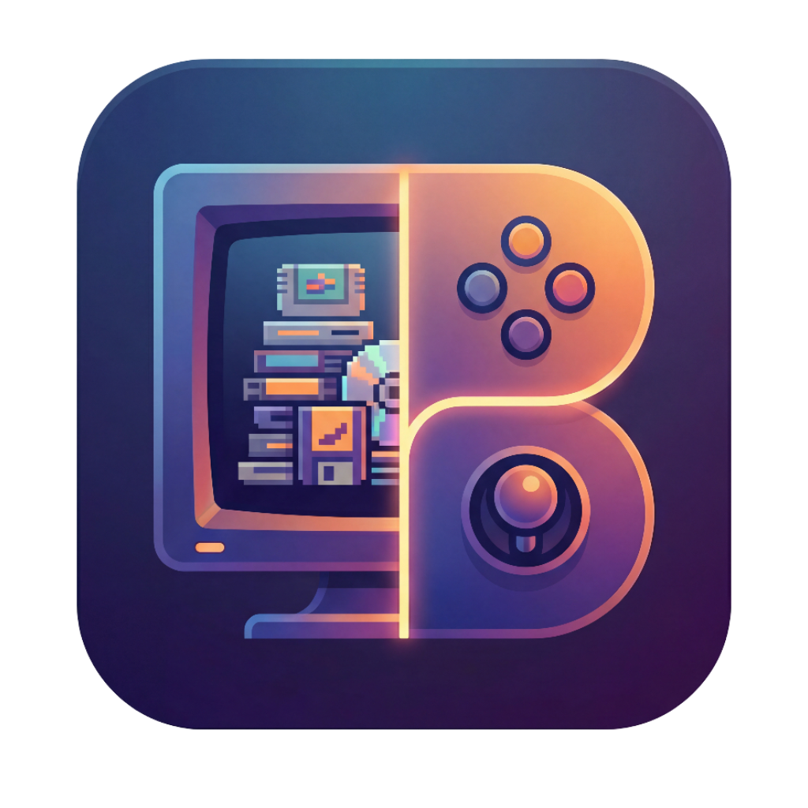

<p align="center">
  
</p>

# Backlogia

**Your entire game library, finally in one place.**

Stop jumping between Steam, Epic, GOG, Xbox, Amazon, and a dozen other launchers just to see what you own. Backlogia aggregates all your games into a single, beautifully organized library with rich metadata, ratings, and discovery features—all running locally on your machine.


---

## Supported Stores

<p align="center">
  
  
  
  
  
  
  
  
  
  
  
</p>

<p align="center">
  <strong>Steam</strong> &nbsp;•&nbsp; <strong>Epic Games</strong> &nbsp;•&nbsp; <strong>GOG</strong> &nbsp;•&nbsp; <strong>Amazon Games</strong> &nbsp;•&nbsp; <strong>itch.io</strong> &nbsp;•&nbsp; <strong>Humble Bundle</strong> &nbsp;•&nbsp; <strong>Battle.net</strong> &nbsp;•&nbsp; <strong>EA</strong> &nbsp;•&nbsp; <strong>Xbox / Game Pass</strong> &nbsp;•&nbsp; <strong>Ubisoft</strong> &nbsp;•&nbsp; <strong>Local Folder</strong>
</p>

---

## Features

### Unified Library

All your games from every store, displayed in one place. Smart deduplication ensures games you own on multiple platforms appear as a single entry with all your purchase information intact.


- **Multi-store filtering** — Filter by store, genre, or search by name
- **Flexible sorting** — Sort by name, rating, playtime, or release date
- **Store indicators** — See at a glance which platforms you own each game on

### Rich Game Details

Every game is enriched with metadata from IGDB (Internet Game Database), giving you consistent information across all stores.


- **Ratings** — Community ratings, critic scores, and aggregated scores
- **Screenshots** — High-quality screenshots from IGDB
- **Direct store links** — Jump straight to any store page
- **Playtime tracking** — See your Steam playtime stats

### Discover Your Library

Find your next game to play with curated discovery sections based on your actual library.


- **Popular games** — Based on IGDB popularity metrics
- **Highly rated** — Games scoring 90+ ratings
- **Hidden gems** — Quality games that deserve more attention
- **Most played** — Your games ranked by playtime
- **Random pick** — Can't decide? Let Backlogia choose for you

### Custom Collections

Organize games your way with custom collections that work across all stores.


- Create themed collections like "Weekend Playlist" or "Couch Co-op"
- Add games from any store to any collection
- Visual collection covers with game thumbnails

### Settings & Sync

Connect your accounts and sync your library with a single click.


- One-click sync per store or sync everything at once
- Secure credential storage
- IGDB integration for metadata enrichment

---

## Quick Start (Docker)

1. **Create a directory and download config files**
   ```bash
   mkdir backlogia && cd backlogia
   curl -O https://raw.githubusercontent.com/sam1am/backlogia/main/.env.example
   curl -O https://raw.githubusercontent.com/sam1am/backlogia/main/docker-compose.ghcr.yml
   cp .env.example .env
   ```

2. **Edit `.env` with your settings** (see [Configuration](docs/configuration.md))

3. **Start the container**
   ```bash
   docker compose -f docker-compose.ghcr.yml up -d
   ```

4. **Access Backlogia** at [http://localhost:5050](http://localhost:5050)

For other installation methods, see the [Installation Guide](docs/installation.md).

---

## Documentation

| Document | Description |
|----------|-------------|
| [Installation Guide](docs/installation.md) | All installation options (Docker pre-built, build from source, local), Docker volumes, and updating |
| [Configuration](docs/configuration.md) | Store credentials, API keys, and local game folder setup |
| [HTTPS & Security](docs/https-and-security.md) | HTTPS via Caddy reverse proxy and optional authentication |
| [Project Information](docs/project-info.md) | Tech stack and general project details |

---

## Acknowledgements

Backlogia is built on the shoulders of these excellent open-source projects:

- **[Legendary](https://github.com/derrod/legendary)** — Epic Games Store integration
- **[Nile](https://github.com/imLinguin/nile)** — Amazon Games integration
- **[PlayniteExtensions](https://github.com/Jeshibu/PlayniteExtensions)** — EA library integration method

Backlogia was built with assistance from Anthropic's Claude and other AI models.

---

## License

MIT License - See [LICENSE](LICENSE) for details.
